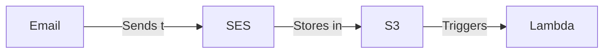

# AWS email-based workflow template

This repo contains starter code for creating an email-based workflow using AWS [SES](https://aws.amazon.com/ses/) and Lambda. The codebase is written in TypeScript and uses [AWS CDK](https://aws.amazon.com/cdk/) to manage the AWS resources and deployments.

**What's an email-based workflow?** It's a way to automate a process using email as the trigger. Send an email to a specific address, and the workflow (a Lambda function in this case) will take action using the email's contents. It's up to you to decide what the workflow does.

## 🧐 How it works



1. An email is sent to a specific address associated with a domain that you own.
1. SES receives the email and stores it in an S3 bucket.
1. S3 triggers a Lambda function.
1. The Lambda function reads the email from S3 and runs your code against it.

## 📂 Project structure

```
├── .github             # GitHub Actions workflows
├── bin
│   └── aws-app.ts      # AWS CDK entry point
├── lib
│   ├── reader.ts       # Lambda function for reading emails
│   ├── stacks          # AWS CDK stacks
│   └── constructs      # Groupings of AWS resources
└── tests
```

## 🧰 Setup instructions

**Prerequisites**

- AWS account
- [AWS CLI](https://docs.aws.amazon.com/cli/latest/userguide/getting-started-install.html)
- Domain name
- Node.js
- Docker

### 1️⃣ Copy this repo

1. This repo is a [template](https://docs.github.com/en/repositories/creating-and-managing-repositories/creating-a-repository-from-a-template#creating-a-repository-from-a-template) repo. [Create a new repo from it.](https://github.com/sawyerh/aws-email-workflow-starter/generate)

### 2️⃣ Install and configure your local environment

1. Copy `.env.example` to `.env` and update its values
1. Install dependencies: `npm install`
1. Update `lib/reader.ts` with your own Lambda code. (Or do an initial run through with what's already in there, which will output some of the email's details to CloudWatch Logs).

### 3️⃣ Manually create an AWS SES rule set

SES only allows one rule set to be active at a time. If you already have a rule set, you can use it. Otherwise, you'll need to follow these steps:

1. [Create an SES rule set](https://docs.aws.amazon.com/ses/latest/dg/receiving-email-receipt-rules-console-walkthrough.html)
1. Set the rule set to **Active**.
1. Set the `SES_RULE_SET_NAME` environment variable in `.env` to the name of the rule set.

### 4️⃣ Deploy to AWS

[AWS CDK](https://aws.amazon.com/cdk/) is used for managing the AWS infrastructure as code. It also handles the compilation and deployment of the Lambda function.

<details>
   <summary>More detail about the CDK CLI</summary>
   The `cdk` CLI is installed as part of the project's dependencies (so should already be installed at this point in the instructions). There are a number of `npm` scripts setup for executing common CDK commands (see `package.json`), and you can execute all `cdk` commands using `npx cdk` (i.e. `npx cdk destroy`).
</details>

1. [Authenticate the AWS CLI](https://docs.aws.amazon.com/cli/latest/userguide/getting-started-quickstart.html)
1. [Bootstrap](https://docs.aws.amazon.com/cdk/latest/guide/bootstrapping.html) the AWS environment:

   ```sh
   npx cdk bootstrap
   ```

1. Optional: Preview the AWS changes to be deployed:

   ```sh
   npm run diff
   ```

1. Deploy everything to AWS:

   ```sh
   npm run deploy
   ```

### 5️⃣ Verify your email domain

This step is only necessary if you are using a new domain that has not been verified in AWS SES already.

<details>
 <summary>More detail about SES and domain verification</summary>

In Amazon SES, a [verified identity](https://docs.aws.amazon.com/ses/latest/dg/creating-identities.html#verify-domain-procedure) is a domain that you use to send or receive email.

Before you can receive an email using Amazon SES, you must create and verify each identity that you're going to use. You must complete the verification process with your DNS provider.

</details>

1. When the stack is deployed following the prior section's steps, it will output the CNAME and MX records that you need to add to your domain's DNS records in order to verify SES is able to receive emails on its behalf.
1. Add the CNAME and MX records to your domain’s DNS settings.

You can check the verification status of your domain in the "Verified identities" section of the AWS SES console page. You should also receive an email when the verification is complete.

## 🚀 Deploying updates

After you've ran through the setup instructions, you can deploy updates to the Lambda function and AWS resources by running:

```sh
npm run deploy
```

## 💅 Tips

- [AWS CDK library docs are here](https://docs.aws.amazon.com/cdk/api/v2/)
- By default, SES is in "Sandbox" mode. This means that you can only send emails to verified email addresses. This might be fine for personal projects. [You can take this action to move out of sandbox mode.](https://docs.aws.amazon.com/ses/latest/dg/request-production-access.html).
- Resource not showing up in AWS? Make sure the region you're viewing in the console matches the region you're deploying to.
- If initial deploy fails and gets stuck in a failed state, you can delete the stack and try again. To preserve the SES domain identity, and destroy all other AWS resources (S3 bucket, SES rules, and Lambda function):

  - Empty the S3 bucket
  - Run the following, where `{RESOURCE_PREFIX}` is the environment value from your `.env`

    ```sh
    npx cdk destroy --exclusively {RESOURCE_PREFIX}Reader
    ```

    Alternatively you can run `npx cdk ls` to view the stack names that you can pass to the `--exclusively` flag.
