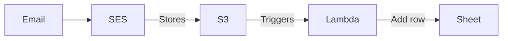

# Expense email workflow

This repo contains an email-based workflow for turning expense emails into rows in a spreadsheet. This repo is based on my [`aws-email-workflow-starter`](https://github.com/sawyerh/aws-email-workflow-starter) template.


## 🧐 How it works



1. An expense email is forwarded to a specific address.
1. SES receives the email and stores it in an S3 bucket.
1. S3 triggers a Lambda function.
1. The Lambda function reads the email from S3 and sends a prompt along with the email's text to GPT.
1. The GPT response includes details like the amount and who the expense was for.
1. The Lambda function adds a row to a Google Sheet with the details.

## 📂 Project structure

```
├── .github             # GitHub Actions workflows
├── bin
│   └── aws-app.ts      # AWS CDK entry point
├── lib
│   ├── reader.ts       # Lambda function for reading emails
│   ├── stacks          # AWS CDK stacks
│   └── constructs      # Groupings of AWS resources
└── tests
```

## 🧰 Setup instructions

**[To setup your initial AWS environment, follow these instructions.](./docs/create-environment.md)**

## 🚀 Deploying updates

After you've ran through the setup instructions, you can deploy updates to the Lambda function and AWS resources by running:

```sh
npm run deploy
```

## 💅 Tips

- [AWS CDK library docs are here](https://docs.aws.amazon.com/cdk/api/v2/)
- By default, SES is in "Sandbox" mode. This means that you can only send emails to verified email addresses. This might be fine for personal projects. [You can take this action to move out of sandbox mode.](https://docs.aws.amazon.com/ses/latest/dg/request-production-access.html).
- Resource not showing up in AWS? Make sure the region you're viewing in the console matches the region you're deploying to.
- If initial deploy fails and gets stuck in a failed state, you can delete the stack and try again. To preserve the SES domain identity, and destroy all other AWS resources (S3 bucket, SES rules, and Lambda function):

  - Empty the S3 bucket
  - Run the following, where `{RESOURCE_PREFIX}` is the environment value from your `.env`

    ```sh
    npx cdk destroy --exclusively {RESOURCE_PREFIX}Reader
    ```

    Alternatively you can run `npx cdk ls` to view the stack names that you can pass to the `--exclusively` flag.
